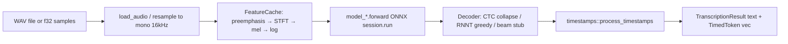

# AGENTS.md — parakeet-rs

Primary reference for AI agents and developers working in this directory.

**Upstream:** [altunenes/parakeet-rs](https://github.com/altunenes/parakeet-rs)  
**This copy:** Local fork under `/home/v2/projects/onnx/parakeet-rs` for experiments and testing. Changes here should stay mergeable with upstream.

---

## Fork Development Philosophy

This fork exists to **extend and improve** the upstream library — not to maintain a divergent product. Every change should satisfy three goals:

1. **Minimal necessary scope** — Touch only the files and APIs required for the goal. Prefer additive changes (new optional params, new scripts, new Cargo features) over refactors that reshape existing modules.
2. **Generic and portable** — Solutions should work for any developer embedding `parakeet-rs` in their own project without fork-specific wiring. Avoid hardcoded local paths, one-off environment assumptions, or behavior that only makes sense in this workspace. Configuration belongs in function arguments, `ModelConfig`, ONNX metadata, or export CLI flags — not in scattered constants tied to a single deployment.
3. **Upstream-mergeable** — Structure work so it can become an upstream PR: follow existing module layout, match naming/style, gate optional capabilities behind Cargo features, and keep `src/lib.rs` re-exports stable unless there is a compelling, documented API reason.

**Prefer extension over modification:**

| Do | Avoid |
|----|-------|
| Add a new export script alongside existing ones | Rewrite `sortformer.rs` for one model variant when metadata-driven config suffices |
| Add optional `ModelConfig` fields with sensible defaults | Change default chunk sizes or EP behavior for all users |
| Document latency tables in export script headers | Embed workspace-specific model paths in Rust or examples |
| Put experimental tooling in `scripts/` (quantize, 8spk export) | Fork the inference core with copy-pasted `model_*.rs` logic |

When a local experiment proves stable, propose it upstream as a small, focused PR rather than letting the fork accumulate permanent divergence.

---

## Fork & Upstream Sync Policy

| Rule | Rationale |
|------|-----------|
| **Extend with minimal diffs** — smallest change that achieves the goal | Keeps review burden low and merge conflicts rare |
| **Keep changes generic** — no project-specific paths, secrets, or deployment hooks | Other developers should `cargo add parakeet-rs` and use features as documented |
| Keep public API changes minimal and documented | Upstream consumers depend on stable `parakeet_rs` exports in `src/lib.rs` |
| Prefer extending `scripts/` over inlining export logic in Rust | Upstream maintains Python NeMo export scripts; Rust constants must match export params |
| When changing streaming constants (e.g. `CHUNK_SIZE` in `nemotron.rs`), update the matching export script and document latency | Export-time `--right-context` and Rust mel-frame counts must agree |
| Run `cargo build` and `cargo test` before proposing upstream PRs | CI only runs build + test on Ubuntu (`/.github/workflows/rust.yml`) |
| Do not commit ONNX weights, model dirs, or `scripts/__pycache__/` | Models are downloaded separately from HuggingFace |

**Current local delta (vs `origin/master`):**

| Path | Status | Notes |
|------|--------|-------|
| `scripts/export_nemotron_streaming.py` | Modified | Export/latency documentation and `--right-context` presets |
| `src/nemotron.rs` | Modified | Comment clarification for 560 ms chunk config |
| `scripts/quantize_nemotron_streaming.py` | Untracked | Local INT8/INT4 quantization tooling (candidate for upstream) |
| `scripts/export_ultra_diar_8spk.py` | Untracked | 8-speaker Sortformer export |
| `src/sortformer.rs` | Modified | Metadata-driven `num_speakers` (default 4); enables 8spk ONNX |
| `AGENTS.md` | Untracked | This file |

---

## 1. High-Level Architecture

### Tech Stack

| Layer | Technology |
|-------|------------|
| Language | Rust 2021 (`parakeet-rs` v0.3.6) |
| Inference | [ort](https://docs.rs/ort) 2.0.0-rc.12 (ONNX Runtime bindings) |
| Arrays | `ndarray` 0.17 |
| Tokenizers | `tokenizers` 0.23 (CTC/EOU/Cohere), custom SentencePiece (Nemotron/TDT/Unified) |
| Audio I/O | `hound` (WAV), `realfft` (STFT/mel) |
| Errors | `eyre` (examples), custom `error::Error` (library) |
| Export tooling | Python + NeMo / PyTorch / Optimum (`scripts/*.py`) |
| CI | GitHub Actions — `cargo build`, `cargo test` on push/PR to `master` |

### System Design

Monolithic Rust library crate with **feature-gated model families**. Each ASR/diarization variant follows a consistent layering:

```
Public API (Parakeet, Nemotron, Sortformer, …)
    → High-level wrapper (audio prep, decode loop, streaming state)
        → model_*.rs (ONNX session I/O, cache tensors)
            → execution.rs (SessionBuilder, EP selection)
```

There is no server, database, or UI. Entry points are:

- **Library API** — `parakeet_rs::*` re-exports from `src/lib.rs`
- **Examples** — `examples/*.rs` (CLI demos)
- **Export scripts** — offline Python pipelines producing ONNX artifacts

Optional Cargo features gate heavier modules: `sortformer`, `multitalker` (implies `sortformer`), `cohere`, and hardware EPs (`cuda`, `tensorrt`, `webgpu`, etc.).

---

## 2. Feature-to-Code Mapping

### Offline ASR

| Feature | Public API | Core Logic | ONNX Layer | Decoder / Vocab |
|---------|------------|------------|------------|-----------------|
| **CTC (English)** | `Parakeet` | `src/parakeet.rs` | `src/model.rs` | `src/decoder.rs` + `tokenizer.json` |
| **TDT (Multilingual, 25 langs)** | `ParakeetTDT` | `src/parakeet_tdt.rs` | `src/model_tdt.rs` | `src/decoder_tdt.rs` + `src/vocab.rs` |
| **Unified (offline + buffered streaming RNNT)** | `ParakeetUnified`, `ParakeetUnifiedHandle` | `src/parakeet_unified.rs` | `src/model_unified.rs` | SentencePiece via `nemotron::SentencePieceVocab` |
| **Cohere Transcribe (14 langs, long-form)** | `CohereASR` *(feature `cohere`)* | `src/cohere.rs` | `src/model_cohere.rs` | HuggingFace `Tokenizer` + prompt tokens |

**Shared offline path:** `Transcriber` trait (`src/transcriber.rs`) → `audio::extract_features_with_cache` → model forward → decode → `timestamps::process_timestamps`.

**Example:** `examples/raw.rs` (CTC), `examples/unified.rs`, `examples/cohere.rs`.

### Streaming ASR

| Feature | Public API | Core Logic | Model I/O | Chunk Size |
|---------|------------|------------|-----------|------------|
| **EOU (real-time, 120M)** | `ParakeetEOU`, `ParakeetEOUHandle` | `src/parakeet_eou.rs` | `src/model_eou.rs` | 160 ms (2560 samples @ 16 kHz) |
| **Nemotron (EN + multilingual 3.5)** | `Nemotron`, `NemotronHandle` | `src/nemotron.rs` | `src/model_nemotron.rs` | 560 ms default (`CHUNK_SIZE=56` mel frames) |
| **Multitalker (multi-speaker streaming ASR)** | `MultitalkerASR` *(feature `multitalker`)* | `src/multitalker.rs` | `src/model_multitalker.rs` | Configurable via `LatencyMode` |

**Streaming state:** encoder caches (`EncoderCache`, `NemotronEncoderCache`, `MultitalkerEncoderCache`), LSTM decoder states, audio FIFO/pre-encode buffers. Handle types (`*Handle`) allow sharing one loaded ONNX session across concurrent streams.

**Examples:** `examples/streaming.rs`, `examples/multitalker.rs`.

### Speaker Diarization

| Feature | Public API | Core Logic | Entry Points |
|---------|------------|------------|--------------|
| **Sortformer v2/v2.1 (4 speakers)** | `sortformer::Sortformer` *(feature `sortformer`)* | `src/sortformer.rs` | `diarize()`, `diarize_chunk()` |
| **Sortformer + TDT combined** | Example composition | `examples/diarization.rs` | Offline full-file |
| **Streaming diarization** | `Sortformer::diarize_chunk` | `src/sortformer.rs` | `examples/streaming_diarization.rs` |

Post-processing: `DiarizationConfig` presets (`callhome()`, `dihard3()`, `custom()`).

### Cross-Cutting Infrastructure

| Concern | Location | Notes |
|---------|----------|-------|
| Audio load + mel/STFT | `src/audio.rs` | **Must use FFT** — naive DFT breaks models (comment at L70–73) |
| Execution providers | `src/execution.rs` | `ExecutionProvider`, `CoreMLComputeUnits`, `ModelConfig::build_session()`; GPU EPs fall back to CPU |
| Timestamps | `src/timestamps.rs`, `src/decoder.rs` | `TimestampMode`: Tokens / Words / Sentences |
| ONNX tensor helpers | `src/tensor_utils.rs` | Flat/3D/4D f32 extraction from `ort` outputs |
| Config structs | `src/config.rs` | `PreprocessorConfig`, `ModelConfig` (CTC defaults hardcoded) |
| Errors | `src/error.rs` | `Result<T>`, variants: Io, Ort, Audio, Model, Tokenizer, Config |

### Export & Quantization Scripts

| Script | Purpose | Rust counterpart |
|--------|---------|------------------|
| `scripts/export_nemotron_streaming.py` | Nemotron EN ONNX export; `--right-context` sets latency | `nemotron.rs` `CHUNK_SIZE`, `PRE_ENCODE_CACHE` |
| `scripts/export_nemotron_streaming_multilingual.py` | Multilingual 3.5 export | Same `Nemotron` API, auto-detects mode |
| `scripts/quantize_nemotron_streaming.py` | Local INT8/INT4 quantization *(fork-only, untracked)* | Load quantized ONNX like any other model dir |
| `scripts/export_realtime_eou_120m.py` | EOU model export | `parakeet_eou.rs` constants |
| `scripts/export_parakeet_unified.py` | Unified RNNT export | `parakeet_unified.rs` |
| `scripts/export_multitalker.py` | Multitalker encoder/decoder export | `multitalker.rs` |
| `scripts/export_diar_sortformer.py` | Sortformer 4spk with tunable chunk/FIFO/cache params | `sortformer.rs` constants (overridable via ONNX metadata) |
| `scripts/export_ultra_diar_8spk.py` | 8-speaker Sortformer export | `sortformer.rs` reads `num_speakers` from ONNX metadata |

Cohere uses upstream Optimum export — no custom script in-repo (`cohere.rs` documents CLI).

---

## 3. Data Flow & Integration

### Life of an Offline Transcription Request



1. Caller invokes `Transcriber::transcribe_file` or `transcribe_samples`.
2. `audio.rs` loads WAV (`hound`), converts stereo→mono if needed, builds log-mel features.
3. Model module runs ONNX with named inputs (`input_features`, caches, etc. per variant).
4. Decoder maps logits/token IDs to text; streaming models maintain state between chunks.
5. Optional timestamp grouping via `TimestampMode`.

### Life of a Streaming Chunk

1. Caller passes fixed-size audio chunk (e.g. 8960 samples for Nemotron 560 ms).
2. Wrapper accumulates pre-encode cache, computes mel for new samples only.
3. Encoder session updates `NemotronEncoderCache` tensors; decoder joint network emits tokens.
4. Text appended incrementally; `NemotronHandle` + `Nemotron::from_shared` clone state per stream.

### Life of Diarization

1. `Sortformer::with_config` loads ONNX, reads optional metadata for chunk/FIFO lengths.
2. Full-file: `diarize` iterates ~10 s chunks with FIFO + speaker cache compression.
3. Streaming: `diarize_chunk` preserves internal FIFO/cache across calls.
4. Raw frame probabilities → median filter → hysteresis → `SpeakerSegment { speaker_id, start, end }`.

### External Integrations

| Integration | Role |
|-------------|------|
| **HuggingFace** | Pre-exported ONNX + tokenizer artifacts (not vendored) |
| **NVIDIA NeMo** | Source checkpoints for export scripts (`.nemo`) |
| **ONNX Runtime** | Inference via `ort`; EPs selected at compile + runtime |
| **No network at runtime** | Library is fully offline once models are local |

---

## 4. Technical Debt & Constraints

### Hard Constraints

- **Audio:** 16 kHz mono; 16-bit PCM or 32-bit float WAV.
- **CTC/TDT length limit:** ~4–5 minutes per call; use streaming models or chunking for longer audio.
- **Nemotron latency is export-time locked:** Changing `--right-context` in export requires updating `CHUNK_SIZE` in `src/nemotron.rs` (see table in `export_nemotron_streaming.py` header).
- **Mel/STFT must match training:** Custom STFT in Rust (librosa-inspired for Sortformer); do not swap for naive DFT.
- **CTC config hardcoded:** `ModelConfig` and `pad_token_id` in `model.rs` / `decoder.rs` assume Parakeet-CTC-0.6b — not read from `config.json` at runtime.

### Known Gotchas

| Area | Detail |
|------|--------|
| **CoreML** | Slower than CPU for dynamic-shape Parakeet graphs; use WebGPU or CPU on Apple (`execution.rs` L12–14, README) |
| **WebGPU EP** | Marked experimental; may produce incorrect results |
| **EOU reset-on-EOU** | Example notes poor real-world behavior (`examples/streaming.rs` L48–49) |
| **Beam search** | Stub only — `decoder.rs` L199 falls back to greedy |
| **Multilingual Nemotron langs** | Prompt dictionary embedded in `nemotron.rs`; 8 "adaptation-ready" langs need fine-tuning for production quality |
| **Sortformer + multitalker** | Multitalker depends on Sortformer raw predictions for speaker masks |
| **Threading** | Streaming handles use `Arc<Mutex<...>>` for ONNX sessions — avoid hot-path lock contention in multi-stream servers |

### Linting / Style

- Rust 2021, standard `cargo fmt` / `cargo clippy` expectations (not enforced in CI beyond build+test).
- Module layout: one `model_*.rs` per ONNX graph family; public facades in `parakeet_*.rs` / top-level names.
- Feature gates: never expose `sortformer`/`multitalker`/`cohere` symbols without the corresponding feature.

### Testing

- **No unit tests in tree** — CI runs `cargo test` but test coverage is minimal.
- Validation is primarily manual via `examples/` with downloaded ONNX weights.

---

## 5. Development Roadmap (Inferred)

| Priority | Item | Where |
|----------|------|-------|
| High | Upstream `quantize_nemotron_streaming.py` if stable | `scripts/` |
| High | Runtime-configurable Nemotron chunk size (read from `config.json` export sidecar) | `nemotron.rs`, `model_nemotron.rs` |
| High | Parameterize `NUM_SPEAKERS` in Sortformer (read from ONNX metadata, default 4) | **Done locally** — `sortformer.rs` |
| Medium | Beam search with optional LM | `decoder.rs` TODO |
| Medium | Integration tests with tiny fixture ONNX graphs | new `tests/` or `#[cfg(test)]` modules |
| Medium | Load CTC/TDT configs from JSON instead of hardcoding | `config.rs`, `model.rs` |
| Low | CoreML graph rewriting for static shapes | `execution.rs` |
| Low | Batch transcription API (currently sequential in `transcriber.rs`) | `Transcriber` trait |

---

## 6. Quick Reference — File Map

```
parakeet-rs/
├── Cargo.toml              # Features, examples, ort EP flags
├── src/
│   ├── lib.rs              # Public re-exports — start here
│   ├── transcriber.rs      # Transcriber trait (offline batch API)
│   ├── execution.rs        # ONNX Runtime session builder
│   ├── audio.rs            # WAV I/O, mel features, FeatureCache
│   ├── parakeet.rs         # CTC facade
│   ├── parakeet_tdt.rs     # TDT facade
│   ├── parakeet_eou.rs     # EOU streaming facade
│   ├── parakeet_unified.rs # Unified RNNT facade
│   ├── nemotron.rs         # Nemotron streaming (EN + multilingual)
│   ├── sortformer.rs       # Diarization [feature sortformer]
│   ├── multitalker.rs      # Multi-speaker ASR [feature multitalker]
│   ├── cohere.rs           # Cohere ASR [feature cohere]
│   ├── model*.rs           # ONNX session wrappers
│   ├── decoder*.rs         # CTC / TDT decoders
│   └── timestamps.rs       # Token/word/sentence grouping
├── examples/               # Runnable demos (need local model dirs)
├── scripts/                # NeMo → ONNX export (+ local quantize)
└── .github/workflows/rust.yml
```

### Model Directory Layouts (on disk, not in repo)

| Variant | Required files |
|---------|----------------|
| CTC | `model.onnx`, `model.onnx_data`, `tokenizer.json` |
| TDT | `encoder-model.onnx`, `decoder_joint-model.onnx`, `vocab.txt` |
| EOU | `encoder.onnx`, `decoder_joint.onnx`, `tokenizer.json` |
| Nemotron | `encoder.onnx`, `encoder.onnx.data`, `decoder_joint.onnx`, `tokenizer.model` |
| Unified | Same layout as Nemotron |
| Multitalker | `encoder*.onnx`, `decoder_joint*.onnx`, `tokenizer.model` + Sortformer ONNX |
| Cohere | `encoder_model.onnx`, `decoder_model_merged.onnx`, `tokenizer.json` |
| Sortformer | `diar_streaming_sortformer_4spk-v2*.onnx` or 8spk exports with `num_speakers` metadata |

---

## 7. Agent Workflow Checklist

When modifying this fork:

1. **Ask: can this be upstream?** If yes, design it generically from the start (no `/home/v2/...` paths, no single-model hacks).
2. Identify the **model family** and whether the change is Rust inference, export params, or both.
3. Choose the **smallest surface area**: script-only > optional config field > new feature flag > public API change.
4. If streaming constants change, update **both** the export script header table and Rust `const` values.
5. Gate new optional backends behind **Cargo features** matching existing EP patterns.
6. Keep `src/lib.rs` re-exports aligned with public API docs in `README.md`.
7. Run `cargo build --all-features` locally if touching feature-gated modules.
8. Structure commits for clean upstream PRs: one logical change per commit, no model binaries.

**Red flags before committing:**

- Diff touches unrelated modules "while we're here"
- Default behavior changes for all users instead of opt-in config
- New constants duplicate export metadata instead of reading `config.json` / ONNX props
- Example or script assumes a specific machine layout or secret env var
